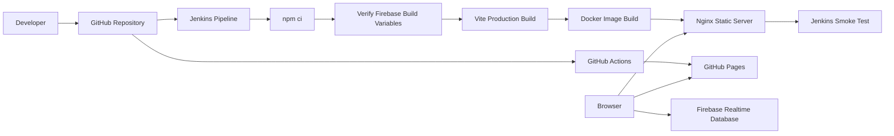

# Architecture

## System Diagram

## Tool Responsibilities

| Tool | Responsibility |
|---|---|
| GitHub | Stores source code, commit history, contribution evidence, and project deliverables |
| Jenkins | Automates install, verify, build, Docker image creation, container run, and smoke test |
| Docker | Packages the built app into a reproducible container |
| Nginx | Serves the production static files in the Docker container |
| Firebase | Stores and syncs tracker data |
| GitHub Actions | Deploys the production static site to GitHub Pages |

## Runtime Flow

1. A user opens either the GitHub Pages site or the Docker-served local site.
2. Nginx or GitHub Pages serves the React/Vite static files.
3. The browser initializes Firebase with public web configuration.
4. Tracker entries are read from and written to Firebase Realtime Database.

## Jenkins Flow

1. Jenkins checks out the repository from GitHub.
2. Jenkins installs dependencies with `npm ci`.
3. Jenkins validates required Firebase build variables.
4. Jenkins builds the app with Vite.
5. Jenkins verifies the built `dist/` output.
6. Jenkins builds a Docker image.
7. Jenkins runs the image on port `8080`.
8. Jenkins requests `http://localhost:8080/ramadan-tracker/` and fails if the app is unavailable.
